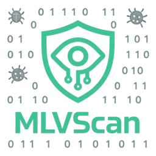
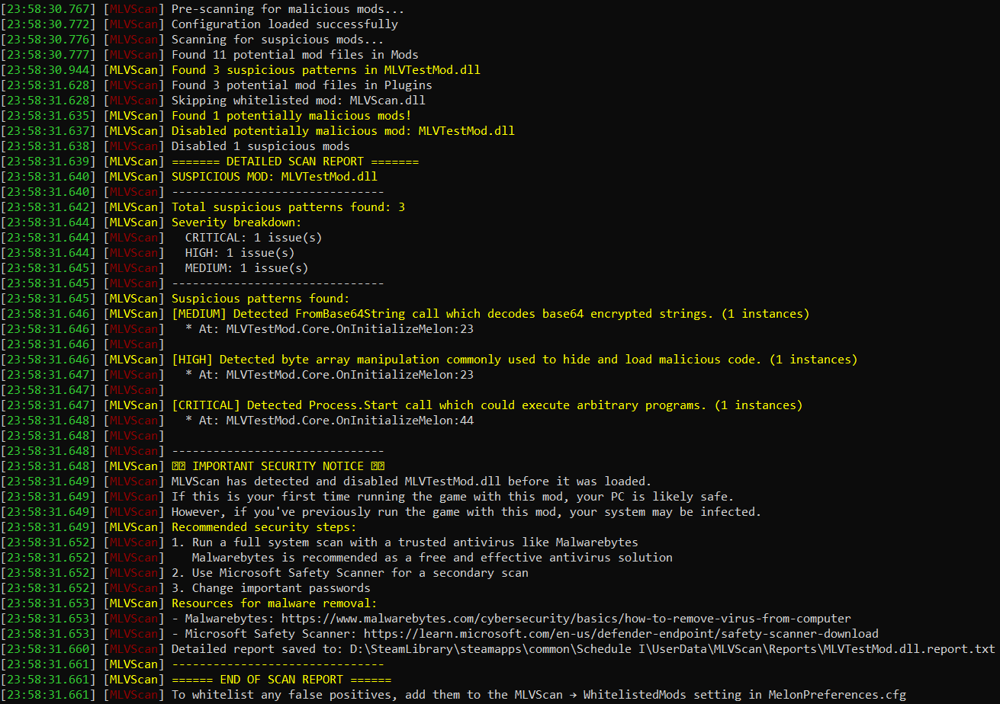

# MLVScan

  

**MLVScan** is a security-focused MelonLoader plugin that protects your game by scanning mods for malicious patterns *before* they execute.

## ⚡ Quick Start

1. **Download** the latest `MLVScan.dll` from [Releases](../../releases).
2. **Install** by dropping it into your game's `Plugins` folder.
3. **Play!** MLVScan automatically scans mods on startup.

## 📚 Documentation

Detailed documentation is available in the **[MLVScan Wiki](https://github.com/ifBars/MLVScan/wiki)**:

*   **[Getting Started](https://github.com/ifBars/MLVScan/wiki/Getting-Started)** - Full installation and setup guide.
*   **[Whitelisting](https://github.com/ifBars/MLVScan/wiki/Whitelisting)** - How to use the SHA256 security whitelist.
*   **[Understanding Reports](https://github.com/ifBars/MLVScan/wiki/Scan-Reports)** - Interpret warnings and security levels.
*   **[Architecture](https://github.com/ifBars/MLVScan/wiki/Architecture)** - How the ecosystem works.
*   **[FAQ](https://github.com/ifBars/MLVScan/wiki/FAQ)** - Common questions and troubleshooting.

## 🛡️ Powered by MLVScan.Core

MLVScan is built on **[MLVScan.Core](https://github.com/ifBars/MLVScan.Core)**, a cross-platform malware detection engine.
The same protection is also available for web browsers via **[MLVScanWeb](../MLVScanWeb)**.

## 🤝 Contributing

We welcome contributions! Please see the [Contributing Guidelines](https://github.com/ifBars/MLVScan.Core/wiki/Contributing) in the Core repository for adding new detection rules.

---
*Licensed under GPL-3.0*
